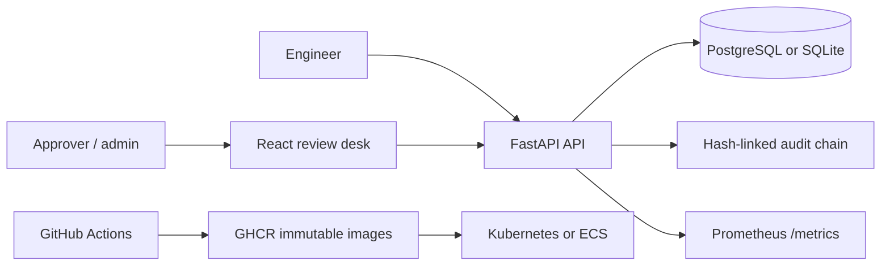

# Gatehouse

**Policy-first access operations for teams that need to move quickly without losing the evidence.**

[](https://github.com/kyan9400/gatehouse/actions/workflows/ci.yml)
[](https://github.com/kyan9400/gatehouse/releases)
[](LICENSE)

Gatehouse is a self-hosted access request and approval control plane. Engineers request narrowly-scoped, short-lived access; approvers see the risk and policy context; every decision is recorded in a verifiable, tenant-scoped audit chain.

## Why it exists

Standing production access creates ambiguity during an incident: who had access, why they needed it, and whether the decision followed policy. Gatehouse gives a team a small, inspectable workflow for just-in-time access without pretending that a static dashboard is an identity provider.

## Product tour

The live dashboard is a deterministic demo that runs without credentials:

**[Open the Gatehouse dashboard →](https://gatehouse-nine.vercel.app)**

The API is ready to run locally or in a cluster with Docker Compose, Kubernetes, or the Terraform AWS path.

## What it demonstrates

| Area | Implementation |
| --- | --- |
| Backend | Async FastAPI, Pydantic validation, SQLAlchemy 2.0, SQLite locally / PostgreSQL in production |
| Authorization | Workspace isolation, API key support, requester/approver/admin roles, explicit step-up policy signals |
| Correctness | Idempotency keys, optimistic locking, policy-bounded TTLs, safe decision conflicts |
| Auditability | Append-only, hash-linked audit events with a per-workspace chain head |
| Frontend | React + TypeScript review desk with live/demo state, responsive layout, and keyboard-friendly controls |
| Delivery | Multi-stage non-root images, health/readiness probes, Kustomize overlays, Terraform, GHCR releases |

## Quick start

```bash
cp .env.example .env
docker compose up --build
```

Open [http://localhost:5173](http://localhost:5173) for the dashboard. The API is available at [http://localhost:8000](http://localhost:8000); use `/docs` locally for the generated OpenAPI reference.

For a fast local development loop:

```bash
cd services/api
python -m venv .venv && .venv/Scripts/activate  # Windows
pip install -e '.[test]'
ruff check app tests
pytest -q

cd ../../apps/web
npm ci
npm run typecheck && npm test && npm run build
```

## Architecture



Read the design notes in [`docs/architecture.md`](docs/architecture.md), the operator workflow in [`docs/operations.md`](docs/operations.md), and the threat model in [`docs/security.md`](docs/security.md).

## API sketch

```http
GET  /api/v1/overview
GET  /api/v1/access-requests?status=pending
POST /api/v1/access-requests
POST /api/v1/access-requests/{id}/approve
POST /api/v1/access-requests/{id}/deny
GET  /api/v1/audit
```

Create requests with an `Idempotency-Key` and include `X-Workspace-ID`, `X-Actor`, and `X-Role` headers. Set `GATEHOUSE_API_KEY` outside local development; production secrets belong in a secret manager, not a checked-in environment file.

## Roadmap

- OIDC-backed identity and SCIM group sync
- Webhook adapters for PagerDuty and Jira change records
- PostgreSQL row-level security option for regulated workspaces
- WebAuthn step-up for break-glass decisions

## License

MIT. See [`LICENSE`](LICENSE).
